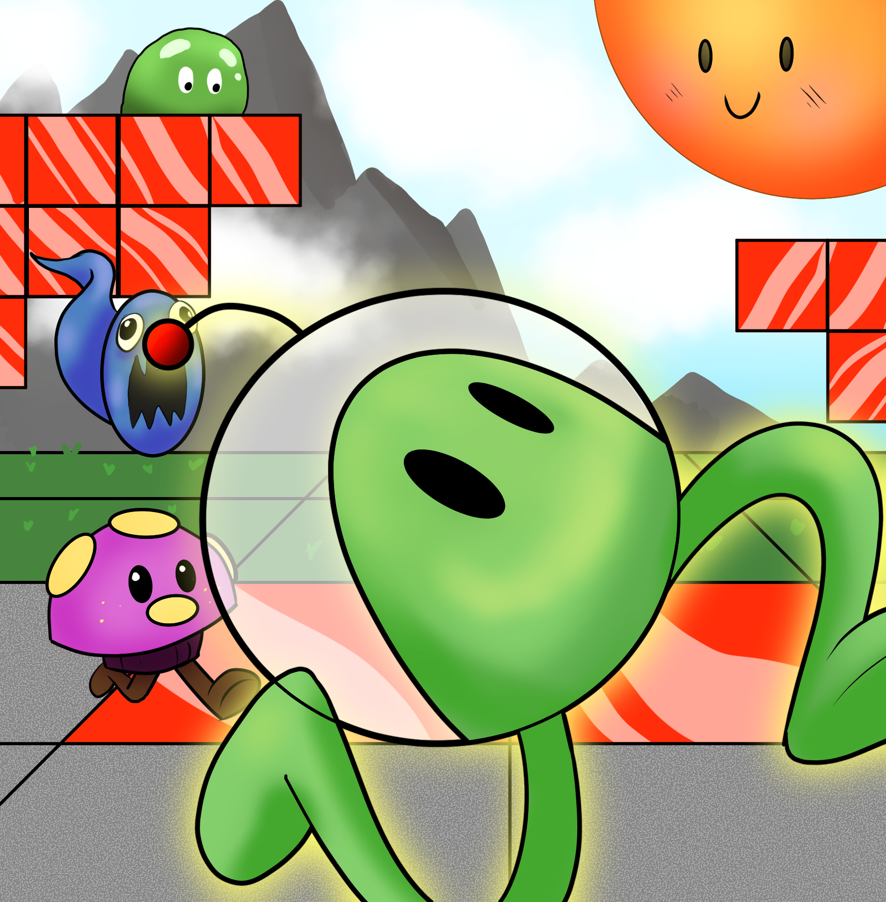
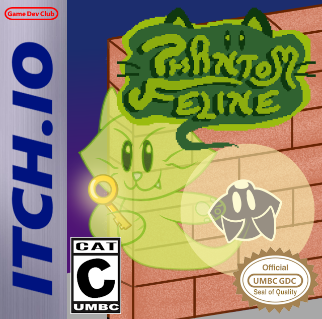
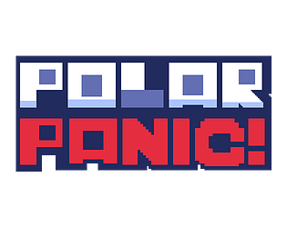
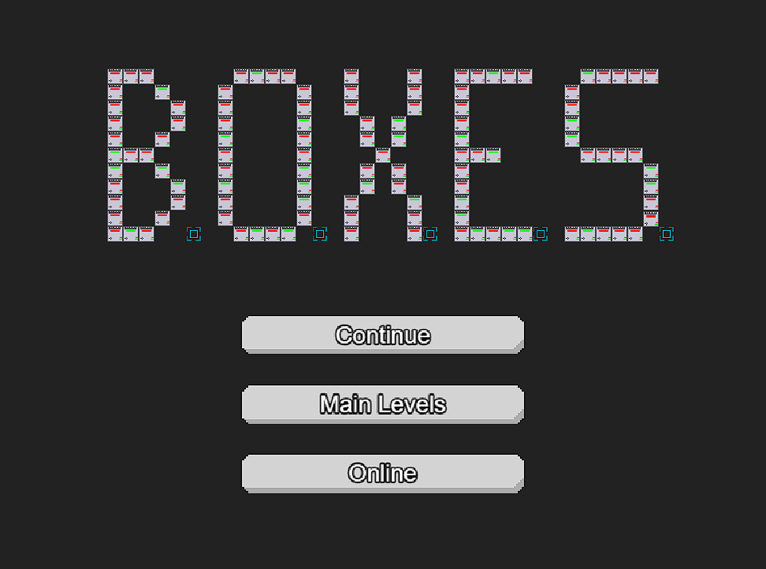
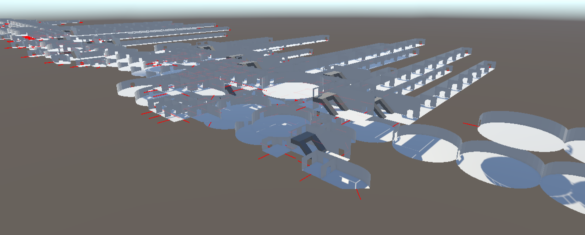
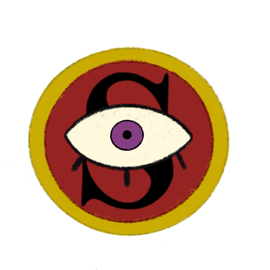
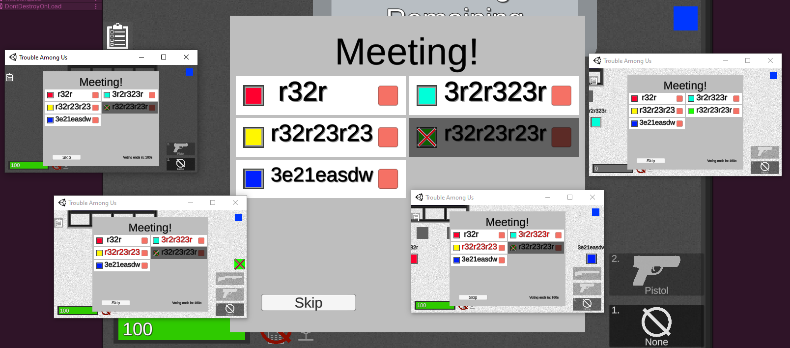
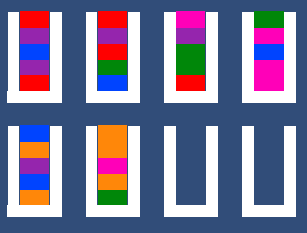

# **Jensen (Jet) Thompson**

## Other Resources
[Itch.io Profile](https://jetinat0r.itch.io/) 
jetthomp@gmail.com 

# Projects

<table>
  <tbody>
    <tr>
      <td>
        
      </td>
      <td>
        
<b>Bullet Blox</b>

        
This is the result of a group project I did as part of my UMBC Games Capstone course, CMSC493. I was lead programmer of the team and worked on almost everything, from UI to gameplay to enemy AI.

        
Bullet Blox is a mobile platforming game that was built in Unity. Traverse through 10 levels leaping over dangerous pits, dodging scary enemies, and using your power over Blox to fight your way to your best friend, the sun!

      </td>
    </tr>
    <tr>
      <td>
        
      </td>
      <td>
        
<b>Phantom Feline</b>

        
This game was made for the UMBC Game Dev Club's 2025 Spring Game Jam. I worked with a small team, and I was responsible for UI, level design, the wall cling mechanic, and ensuring that the game renders like a gameboy game

        
Phantom Feline is a puzzle platforming game that was made in Unity. Make your way through 8 challenging rooms by projecting yourself onto walls when in light, flipping switches, and dodging dangerous robot vacuums!

        
Available on browser and all major operating systems: <a href="https://averyicypenguin.itch.io/phantom-feline">https://averyicypenguin.itch.io/phantom-feline</a>

      </td>
    </tr>
    <tr>
      <td>
        
      </td>
      <td>
        
<b>Polar Panic</b>

        
This game was made for the Winter MelonJam 2024. I worked with a small team, and I was responsible for the magnet system, the bullet hell system, and designing bullet patterns for the enemies

        
Polar Panic is an arcade style bullet hell game that was made with Unity. Use your magnet board to catch and reflect magnetized bullets, and try to clear as many waves as you can!

        
Available on browser and Windows: <a href="https://averyicypenguin.itch.io/phantom-feline">https://averyicypenguin.itch.io/phantom-feline</a>

      </td>
    </tr>
    <tr>
      <td>
        
      </td>
      <td>
        
<b>B.O.X.E.S.</b>

        
This project is the result of a group project with Phaser, Flask, and SQLite I did for my Software Engineering class at UMBC, CMSC. I worked with a small team, and I was responsible for UI, gameplay, the level editor, and database communication

        
B.O.X.E.S. is a box pushing puzzle game that was made with Phaser. Push boxes to solve puzzles, design and upload your own puzzles with the built in level editor, and solve other players' uploaded puzzles!

      </td>
    </tr>
    <tr>
      <td>
        
      </td>
      <td>
        
<b>Bullet Hell Engine</b>

        
This was a personal project in Unity to create a highly modular bullet engine and to learn about how to implement modding as a built in feature. This project has been abandoned, but was an excellent learning opportunity

        
The core of the engine was that bullets had no behaviors by default, and instead relied on special components to hook into base methods. Through this system, adding effects onto projectiles was as simple as adding a component, and it meant that behaviors could be added to existing projectiles without changing anything about them. Another core component of the engine was that it used object pooling to lower the performance cost.

        
The most interesting part of this project was the dynamic dll loading and runtime C# compilation through <a href="https://github.com/dotnet/roslyn">Roslyn</a>. If a mod was compiled against the engine's built dll, the engine could pick it up and load externally defined behaviors. Also, if a pre compiled dll is too scary, the engine was able to take raw .cs files and compile them itself, and then load the brand new behaviors. Since modding usually happens in a compiled build, I also added a built-in output log that caught all Debug.Log/Warning/Errors and printed them to a developer console.

      </td>
    </tr>
    <tr>
      <td>
        
      </td>
      <td>
        
<b>Tindalos</b>

        
This project was for UMBC's Game Dev Club, though was never completed.

        
This game was intended to be a roguelike, so one system I worked on was a 3D, tile free random room generation system that would stitch rooms together door to door, without being locked to a grid nor requiring awkward hallways to line up the rooms. In order to achieve this, I had to create a custom editor to define the layout of rooms including where the doors and walls were. As this game was based on the <a href="https://en.wikipedia.org/wiki/Hounds_of_Tindalos">The Hounds of Tindalos</a>, I also created a shader to give enemies an eldritch, otherworldly feel, based on <a href="https://en.wikipedia.org/wiki/Ferrofluid">ferrofluids</a>.

      </td>
    </tr>
    <tr>
      <td>
        
      </td>
      <td>
        
<b>Lost & Found</b>

        
This project was for UMBC's Game Dev Club with a small team, and was a story driven 2D game made in Unity

        
For this game I mainly focused on implementing systems. I made a custom node based editor to link rooms together, with conditions for locked doors and changing the room at different times of day. I also made a system to dynamically populate rooms based on time of day, game state, and quest states. I made a dialogue system with swappable portraits, pauses, and escapable sequences for Text Mesh Pro's built in text manipulation. I also made custom editors to streamline the design and set up of those dynamic rooms and dialogues.

        
Available on Windows and Mac: <a href="https://averyicypenguin.itch.io/phantom-feline">https://tonio-tech.itch.io/lost-found</a>

      </td>
    </tr>
    <tr>
      <td>
        
      </td>
      <td>
        
<b>Trouble Among Us</b>

        
This was a personal project in Unity to create an online multiplayer game, jumping on the Among Us bandwagon of the time while trying to mix in some elements of Trouble in Terrorist Town. This project has been abandoned, but taught me a lot about networking with TCP and UDP

        
This project included a field of view mask that hid other players, weapons to fight the traitor or neutralize innocents with, 2D minigame tasks, voting, online multiplayer, and proximity voice chat. Multiplayer was managed through a dedicated server that clients would connect to, and which would communicate game state and player actions to all players.

      </td>
    </tr>
    <tr>
      <td>
        
      </td>
      <td>
        
<b>Block Sort</b>

        
This was a personal project in Unity to create a clone of a fluid sorting mobile game

        
This project is a simple clone of those bottled fluid sorting games, and was made because my mom paid one to get rid of ads, and the ads persisted. I thought: "this is so simple, I could just make it myself!" And so over a week I made this game and exported it to Android. I also wanted to one-up the game I was cloning, so I added adjustable difficulty settings and made the movements quicker and more responsive.

      </td>
    </tr>
    <tr>
      <td>
        
      </td>
      <td>
        
<b>First Person Bullet Hell</b>

        
This was my first serious video game project, and I used Unity to create a 3D, first person bullet hell game

        
The project didn't do too well in the bullet hell aspect, but taught me a lot about how Unity worked, how math in 3D functioned, and to never bake lighting on an integrated graphics card ever again

      </td>
    </tr>
  </tbody>
</table>
